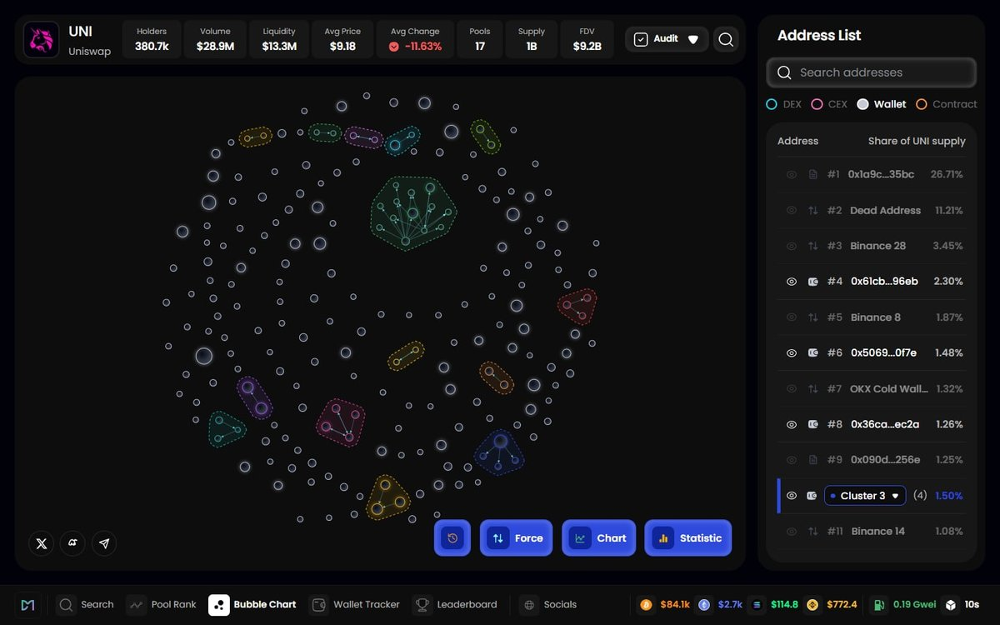
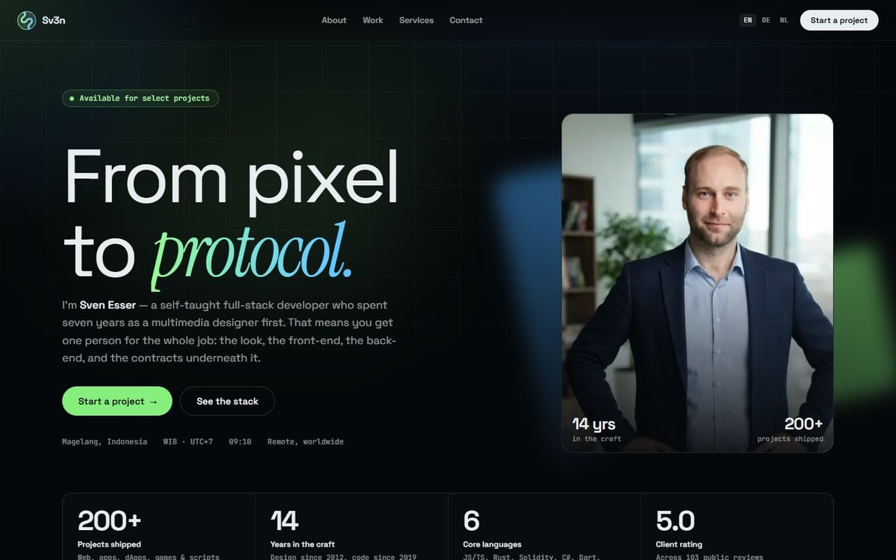

# Hi, I'm Sven (Sv3n) 👋

Full-stack developer based in Yogyakarta, Indonesia. I've been building for the web since 2014 and working as a full-time developer since 2019.

My main stack is **MERN** (MongoDB, Express, React, Node.js), along with **TypeScript**, **Vue 3**, and **Rust**. I also work on **Ethereum and Solana** development — mostly DEX-related tooling and custom smart contracts.

Before landing on this stack I worked with Flutter/Dart, Python, Go, and C# (Unity). I also come from a multimedia design background (2D animation, graphic design, UI/UX), so I can help there too if a project needs it.

## 🚀 Featured work

<table>
  <tr>
    <td width="50%" valign="top">
      
      <h3><a href="https://dexmarketcap.app">DexMarketCap.app</a></h3>
      
A real-time DEX analytics platform (a DexScreener-style alternative): pool rankings, holder bubble maps, wallet tracking and a leaderboard. Built with React, Node.js, MongoDB and Web3/ethers.js, including a MongoDB aggregation pipeline for per-wallet P&amp;L tracking.

      
<a href="https://dexmarketcap.app"><b>Open DexMarketCap →</b></a>

    </td>
    <td width="50%" valign="top">
      
      <h3><a href="https://sv3n.dev?utm_source=github&utm_medium=profile&utm_content=title">Sv3n.dev</a></h3>
      
My portfolio, built with Astro: static, in English, German and Dutch, with a 3D fly-through of recent client websites and live demos of the Web3, Rust and Flutter work.

      
<a href="https://sv3n.dev/portfolio?utm_source=github&utm_medium=profile&utm_content=portfolio"><b>See the portfolio →</b></a>

    </td>
  </tr>
</table>

## 🛠️ Tools I actually reach for

### Languages

### Front-end

### Back-end & Data

also: Socket.io

### Web3

also: Ethereum, Solana, Polygon, Web3.js, WalletConnect, Chainlink

### Apps & Games

### Design

also: InDesign

### Tools & Cloud

## 📊 Stats

## 📫 Work with me

Have something to build? [Start a project on Sv3n.dev](https://sv3n.dev/contact?utm_source=github&utm_medium=profile&utm_content=contact) — I usually reply within 24 hours.
